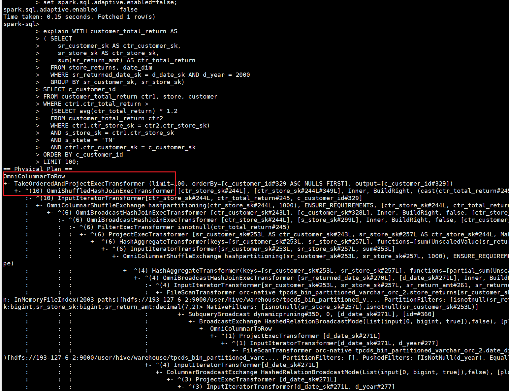

# 项目介绍

## Gluten介绍

Gluten的目的是构建一个统一、开放、高性能的数据计算层，通过解耦计算引擎和执行引擎，打破大数据生态的性能壁垒，让Spark计算框架能够无缝、高效地利用下一代原生向量化执行引擎，从而显著提升数据处理能力。当前项目是基于Gluten项目做增强，接入鲲鹏自研向量化执行引擎OmniOperator，使其在arm平台上拥有更出色的性能表现。

# 版本说明

**当前版本适用于开源软件哪个版本，如**

| 开源软件 | 开源版本 |
| -------- | -------- |
| Gluten   | 1.3.0    |
| spark    | 3.3.1    |

# 快速上手

### Gluten-Omni 快速上手

####  编译命令

Gluten-Omni编译命令如下

```shell
cd Gluten
#编译cpp代码，编译产物：libspark_columnar_plugin.so
bash cpp-omni/build.sh

#编译java/scala代码，编译产物：gluten-omni-bundle-spark3.3_2.12-openEuler_22.03_aarch_64-1.3.0.jar
mvn clean package -Pbackends-omni -Pspark-3.3 -DskipTests -Dspotless.check.skip=true -Dscalastyle.skip=true -Dcheckstyle.skip=true
```

注：Gluten-Omni编译和运行均依赖OmniOperator，若未编译部署OmniOperator，请先参考OmniOperator 相关文档进行编译部署。

#### 环境部署

假定OMNI_HOME为/opt/omni-operator

1. 参考OmniOperator部署文档进行下载依赖包部署，文档链接：https://www.hikunpeng.com/document/detail/zh/kunpengbds/appAccelFeatures/sqlqueryaccelf/kunpengbds_omniruntime_20_0212.html
2. 将编译产物拷贝到${OMNI_HOME}/lib
3. 将/opt/omni-operator目录拷贝到任务提交节点和计算节点

#### 测试验证

* 测试步骤：

1. 使用hive-testbench导入2GB TPCDS数据集
2. 添加omni相关参数，并执行sql
3. 检查执行计划中的算子是否包含Omni


执行计划里面包含Omni就表示使能Gluten-Omni成功

* 参考启动命令

````shell
export OMNI_HOME=/opt/gluten-omni
export /opt/gluten-omni/lib:/usr/local/lib64

spark-sql --master yarn  --driver-cores 20     --driver-memory 40g     --num-executors 12 --executor-cores 40 --executor-memory 20g     --conf spark.memory.offHeap.enabled=true --conf spark.memory.offHeap.size=100g     --conf spark.sql.orc.impl=native     --conf spark.network.timeout=600     --conf spark.sql.broadcastTimeout=600     --conf spark.serializer=org.apache.spark.serializer.KryoSerializer     --conf spark.shuffle.manager=org.apache.spark.shuffle.sort.ColumnarShuffleManager     --conf spark.gluten.sql.columnar.backend.lib=omni     --conf spark.plugins=org.apache.gluten.GlutenPlugin     --conf spark.driver.extraClassPath=/opt/gluten-omni/lib/gluten-omni-bundle-spark3.3_2.12-openEuler_22.03_aarch_64-1.3.0.jar:/opt/gluten-omni/lib/boostkit-omniop-bindings-1.9.0-aarch64.jar     --conf spark.executor.extraClassPath=/opt/gluten-omni/lib/gluten-omni-bundle-spark3.3_2.12-openEuler_22.03_aarch_64-1.3.0.jar:/opt/gluten-omni/lib/boostkit-omniop-bindings-1.9.0-aarch64.jar     --conf spark.executorEnv.LD_LIBRARY_PATH=/opt/gluten-omni/lib:/usr/local/lib64     --conf spark.executorEnv.OMNI_HOME=/opt/gluten-omni     --conf spark.driverEnv.LD_LIBRARY_PATH=/opt/gluten-omni/lib:/usr/local/lib64     --conf spark.driverEnv.OMNI_HOME=/opt/gluten-omni     --conf spark.executorEnv.MALLOC_CONF=narenas:2     --conf spark.driverEnv.LD_PRELOAD=/usr/local/lib/libjemalloc.so.2     --conf spark.executorEnv.LD_PRELOAD=/usr/local/lib/libjemalloc.so.2     --conf spark.gluten.sql.columnar.libpath=/opt/gluten-omni/lib/libspark_columnar_plugin.so     --conf spark.sql.shuffle.partitions=1000     --conf spark.sql.adaptive.coalescePartitions.minPartitionNum=400     --conf spark.sql.adaptive.coalescePartitions.initialPartitionNum=400     --conf spark.kryoserializer.buffer.max=1024m     --conf spark.gluten.sql.columnar.backend.omni.combineJoinedAggregates=true     --conf spark.gluten.sql.columnar.backend.omni.joinReorderEnhance=true     --conf spark.gluten.sql.columnar.backend.omni.dedupLeftSemiJoin=true     --conf spark.gluten.sql.columnar.backend.omni.pushOrderedLimitThroughAggEnable=true     --conf spark.gluten.sql.columnar.backend.omni.adaptivePartialAggregation=true     --conf spark.gluten.sql.columnar.backend.omni.filterMerge=true     --conf spark.gluten.sql.native.union=true     --conf spark.gluten.sql.columnar.backend.omni.preferShuffledHashJoin=true     --conf spark.gluten.sql.columnar.backend.omni.aggregationSpillEnabled=false     --conf spark.gluten.sql.columnar.backend.omni.vec.predicate.enabled=true     --conf spark.gluten.sql.columnar.backend.omni.rewriteSelfJoinInInPredicate=true     --conf spark.reducer.maxSizeInFlight=128m     --conf spark.gluten.sql.columnar.maxBatchSize=8192     --conf spark.gluten.sql.columnar.physicalJoinOptimizeEnable=true     --conf spark.gluten.sql.columnar.physicalJoinOptimizationLevel=19     --conf spark.sql.sources.parallelPartitionDiscovery.parallelism=250
````

# 贡献指南

如果使用过程中有任何问题，或者需要反馈特性需求和bug报告，可以提交isssues联系我们，具体贡献方法可参考[这里](https://gitcode.com/boostkit/community/blob/master/docs/contributor/contributing.md)。

# 免责声明

此代码仓计划参与Gluten软件开源，仅作Gluten功能扩展/Gluten性能提升，编码风格遵照原生开源软件，继承原生开源软件安全设计，不破坏原生开源软件设计及编码风格和方式，软件的任何漏洞与安全问题，均由相应的上游社区根据其漏洞和安全响应机制解决。请密切关注上游社区发布的通知和版本更新。鲲鹏计算社区对软件的漏洞及安全问题不承担任何责任。

# 许可证书

https://www.apache.org/licenses/LICENSE-2.0

# 参考文档

开发者文档（链接）
测试指导文档（链接）